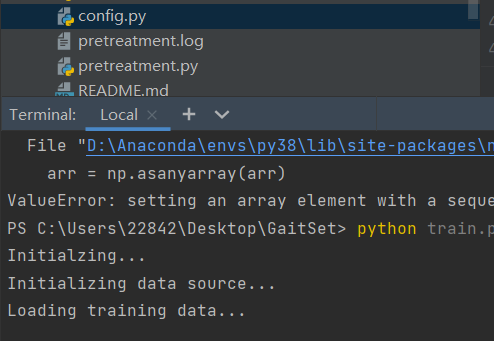
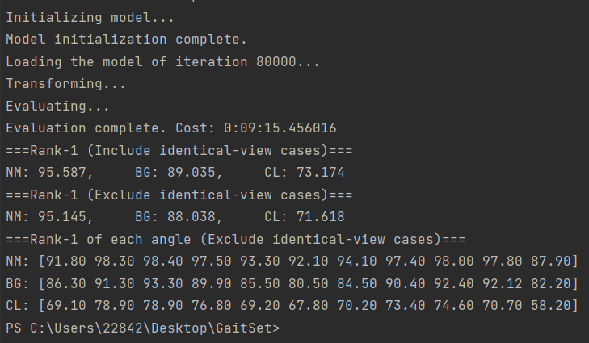

# GaitSet CASIA-B Project


## Overview

This repository is a cleaned training setup for gait recognition based on the GaitSet paper and codebase, adapted for local CASIA-B experiments.

## Preview

| Training | Testing |
| --- | --- |
|  |  |

## Highlights

- GaitSet-based gait-recognition workflow
- pretreatment pipeline for silhouette preparation
- preserved training / testing screenshots for quick preview
- modular model and utility structure

## Project Structure

- `train.py`: train the GaitSet model
- `test.py`: evaluate a saved checkpoint
- `pretreatment.py`: align and crop raw silhouette sequences
- `batch_unzip.py`: batch archive extraction helper
- `config.py`: project configuration
- `model/`: network, loss, data loading, and evaluation code
- `figures/`: screenshots and result images

## Setup

```bash
pip install -r requirements.txt
```

## Usage

Prepare the dataset locally, then run pretreatment:

```bash
python pretreatment.py --input_path path/to/raw_dataset --output_path path/to/output
```

Train:

```bash
python train.py --cache=True
```

Test:

```bash
python test.py --iter=80000 --batch_size=1 --cache=False
```

## Notes

- Large checkpoints, partitions, caches, and datasets are intentionally excluded.
- This repository is a cleaned code snapshot rather than a full reproducibility package.
